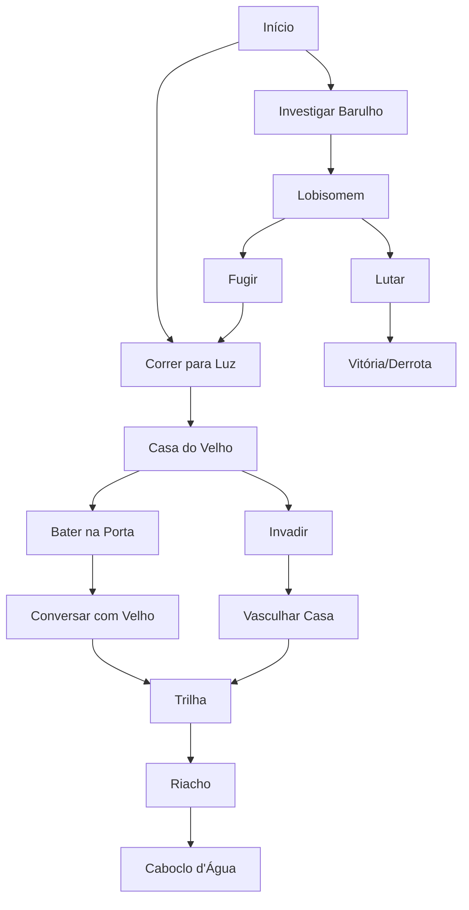

# 🎲 Design do Jogo - RPG Folclore Brasileiro

## 📋 Visão Geral

Este documento detalha o design e mecânicas do RPG de texto com temática do folclore brasileiro.

## 🎮 Mecânicas de Jogo

### Sistema de Combate

O combate é baseado em um sistema simples de força total:

```
Força Total = Nível do Personagem + Modificadores de Equipamentos + Modificadores de Status
```

#### Cálculo de XP
```gdscript
XP Ganho = ((Força do Monstro - Nível do Personagem) / 2) * 10
```

#### Nível e Progressão
- **XP Máximo por Nível**: `90 + (100 * (Nível / 10))`
- **Sistema de múltiplos níveis**: Possível ganhar vários níveis de uma vez

### Sistema de Inventário

#### Tipos de Equipamentos
| Tipo | Enum | Descrição |
|------|------|-----------|
| Capacete | `TIPO_ITEM.Capacete` | Proteção para cabeça |
| Armadura | `TIPO_ITEM.Armadura` | Proteção corporal |
| Calça | `TIPO_ITEM.Calca` | Proteção para pernas |
| Bota | `TIPO_ITEM.Bota` | Proteção para pés |
| Arma | `TIPO_ITEM.Arma` | Equipamento de ataque |
| Luvas | `TIPO_ITEM.Luvas` | Proteção para mãos |

#### Itens Disponíveis
- **Chapéu Soviético** (Capacete)
- **Calça de Uniforme** (Calça)
- **Boné MST** (Capacete)
- **Camisa Velha** (Armadura)
- **Calça Velha** (Calça)
- **Chinelos Velhos** (Bota)
- **Facão** (Arma)

### Sistema de Status

#### Tipos de Status
| Tipo | Enum | Descrição |
|------|------|-----------|
| Habilidade Passiva | `TIPO_STATUS.HABILIDADE_PASSIVA` | Efeitos permanentes |
| Maldição | `TIPO_STATUS.MALDICAO` | Efeitos negativos |
| Condição | `TIPO_STATUS.CONDICAO` | Efeitos temporários |

#### Status Implementados
- **Atordoado**: Condição que afeta o personagem
- **Cansado**: Condição aplicada ao invadir a casa

## 🐺 Bestiário

### Criaturas do Folclore

#### Lobisomem
- **ID**: `MONSTRO_ID.LOBISOMEM`
- **Localização**: Floresta inicial
- **Comportamento**: Primeiro encontro hostil

#### Caboclo d'Água
- **ID**: `MONSTRO_ID.CABOCLO_DAGUA`
- **Localização**: Riacho na trilha
- **Comportamento**: Encontro ao beber água ou continuar trilha

## 🗺️ Estrutura Narrativa

### Atos Principais

1. **Início na Floresta** (`ATO_INICIO`)
   - Escolha inicial: correr para luz ou investigar barulho

2. **Encontro com Lobisomem** (`ATO_LOBISOMEM`)
   - Combate ou fuga
   - Primeira mecânica de combate

3. **Casa do Velho** (`ATO_ENTROU` / `ATO_INVADIU`)
   - Duas abordagens: bater na porta ou invadir
   - Diferenças nas recompensas e status

4. **Exploração da Trilha** (`ATO_INVESTIGAR_TRILHA`)
   - Descoberta de novos cenários
   - Transição para área do riacho

5. **Riacho e Caboclo** (`ATO_CABOCLO`)
   - Segundo encontro de combate
   - Final atual do protótipo

### Ramificações da História



## 🔧 Arquitetura Técnica

### Padrão Manager

O jogo utiliza o padrão Manager para gerenciar diferentes sistemas:

- **ItemManager**: Gerencia todos os itens do jogo
- **StatusManager**: Gerencia efeitos de status
- **MonstroManager**: Gerencia criaturas e combates
- **DadosPersonagem**: Singleton para dados do jogador

### Sistema de Autoload

```gdscript
[autoload]
Global="*res://scripts/Global.gd"
ItemManager="*res://cenas/personagem/inventario/ItemManager.tscn"
StatusManager="*res://cenas/personagem/inventario/StatusManager.tscn"
MonstroManager="*res://cenas/monstro/MonstroManager.tscn"
DadosPersonagem="*res://cenas/personagem/scripts/DadosPersonagem.gd"
```

### Fluxo de Telas

1. **Floresta.tscn**: Cena principal do jogo
2. **ConfigPersonagem.tscn**: Tela de inventário
3. **PainelLuta**: Sistema de combate integrado

## 🎨 Diretrizes Visuais

### Resolução e Arte
- **Resolução Base**: 640x360 pixels
- **Estilo**: Pixel art
- **Paleta**: Cores terrosas e naturais
- **Filtros**: Desabilitados para manter estética pixel art

### Assets Principais
- **Backgrounds**: Cenários atmosféricos da floresta brasileira
- **Sprites**: Personagens e criaturas do folclore
- **UI**: Interface minimalista e funcional

## 🎯 Balanceamento

### Progressão Sugerida
1. **Nível 1-3**: Combates básicos, aprendizado de mecânicas
2. **Nível 4-6**: Introdução de equipamentos melhores
3. **Nível 7+**: Combates mais desafiadores

### Dificuldade dos Monstros
- **Lobisomem**: Inimigo introdutório
- **Caboclo d'Água**: Desafio intermediário
